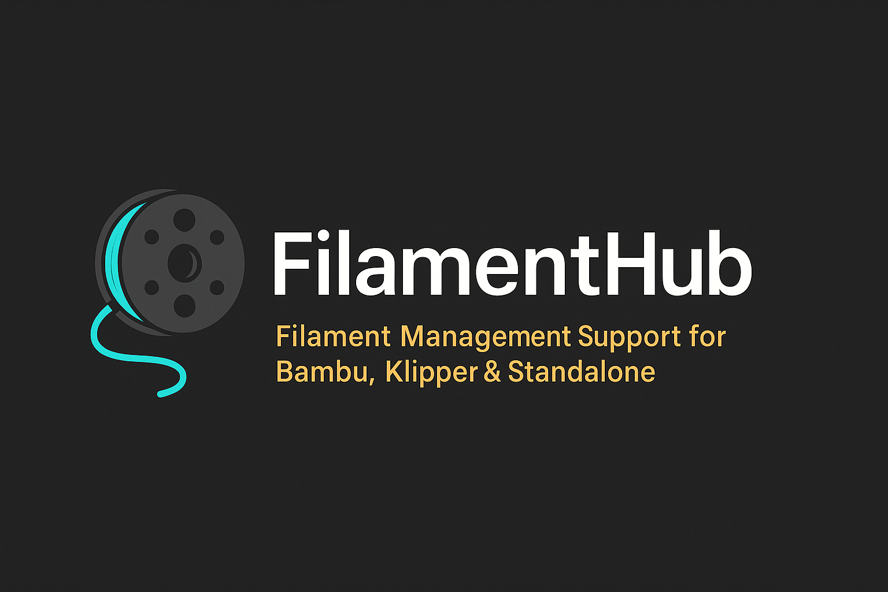

  

<h1 align="center">FilamentHub</h1>

Modernes, lokales Filament-Management für Bambu, Klipper & Standalone.

> 🌍 **English version available here:**  
> 👉 [README.en.md](README.en.md)
---

# 🌟 Features (aktuell & geplant)

### ✔ Automatische Bambu LAN Integration
- AMS Slot-Erkennung  
- Live-Verbrauch (mm)  
- Automatische Spulenerkennung  
- Erkennung „Neue Spule“ und „Alte Spule wieder eingesetzt“  
- Job-Historie  

### ✔ Klipper Integration
- Verbindung über Moonraker API  
- Verbrauchsauswertung  
- Spule pro Druck auswählbar  

### ✔ Bambu Cloud Modus (ohne LAN)
- Verbrauch aus L-Dateien (Cloud)  
- Spule manuell wählbar  

### ✔ Material- & Spulenverwaltung
- Dichte, Farbe, Durchmesser  
- Restgewicht-Berechnung  
- angebrochene/voll/leer  
- Materiallager  

### ✔ Physikalisch exakte Berechnung
- mm → g über Dichte & Querschnitt  
- extrem präzise Restgewichtsberechnung  

### ✔ Dashboard
- Verbrauch pro Tag/Monat  
- aktive Drucke  
- Spulenstatus  
- Materialübersicht  

### ✔ Deployment
- Docker  
- Raspberry Pi  
- Unraid Template  
- ZIP-Installation  

---

# 🧭 Projekt-Roadmap (World Map)

Diese Roadmap ist auf **meine persönliche Zeitplanung abgestimmt**:
 
- ab Januar → Geplanter der Start mit Phase 1
---

## 🧱 PHASE 1 – Grundgerüst   
**Ziel:** Minimal lauffähiges System.

- Repo anlegen  
- Ordnerstruktur erstellen  
- FastAPI Grundgerüst  
- Dockerfile Stub  
- config.yaml Vorlage  
- Leeres UI im Browser anzeigen  

**Status:** 🔄 geplant  

---

## 🎨 PHASE 2 – UI/Design Dark Mode   
**Ziel:** Optik komplett modern & fix.  
- Dark Theme  
- Karten, Layout  
- Navigation  
- Dashboard Skeleton  
- Tabellen, Icons  

**Status:** 🔄 geplant  

---

## 📦 PHASE 3 – Material & Spulen  
**Ziel:** vollständiges Filamentlager.  
- Materials DB  
- Spulenverwaltung  
- UUIDs  
- Restgewicht (manuell)  
- Materialsignatur  

---

## 🔌 PHASE 4 – Bambu LAN Integration  
**Ziel:** Vollautomatik.  
- MQTT Parser  
- AMS Slots  
- Live mm Verbrauch  
- „Neue Spule“ Erkennung  
- „Alte Spule wieder eingesetzt“ Logik  
- Jobs speichern  

---

## ☁️ PHASE 5 – Bambu Cloud Modus   
**Ziel:** System nutzbar ohne LAN.  
- Verbrauch aus L-Datei  
- Spulenwahl manuell  
- Job-Ende Erkennung  

---

## 🤖 PHASE 6 – Klipper Support  
- Moonraker API  
- aktive Spule setzen  
- Jobs speichern  
- Verbrauch mm → g  

---

## 🧠 PHASE 7 – Verbrauchsengine   
**Ziel:** Physik komplett integrieren.  
- mm → g  
- Dichte-Bibliothek  
- Toleranzsystem  
- Verbrauchshistorie  

---

## 📊 PHASE 8 – Dashboard & Statistiken   
**Ziel:** Monitoring fertig.  
- Charts  
- Tages-/Monatsverbrauch  
- angebrochene Spulen  
- Lagerauswertung  

---

## 🐳 PHASE 9 – Deployment   
**Ziel:** Release.  
- ZIP Installer  
- Docker Multi-Arch  
- Unraid Template  
- Pi Guide  

---

# 🏁 Finale Fertigstellung: **Mai 2026**  
Ein modernes, automatisches, plattformübergreifendes Filament-Verwaltungssystem.

---

# 🔧 Setup (später ergänzt)
- Docker Installation  
- Raspberry Pi Setup  
- Unraid Template  

---

# 🤝 MIT License (optional)
Wird später ergänzt.

---

# 📌 Kontakt
Entwickelt von **d3nn3s08** (GitHub)

