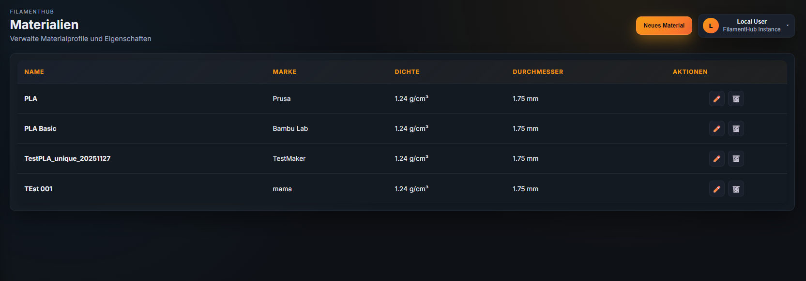
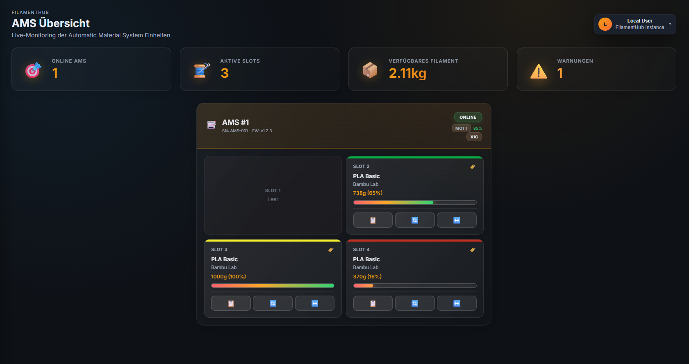
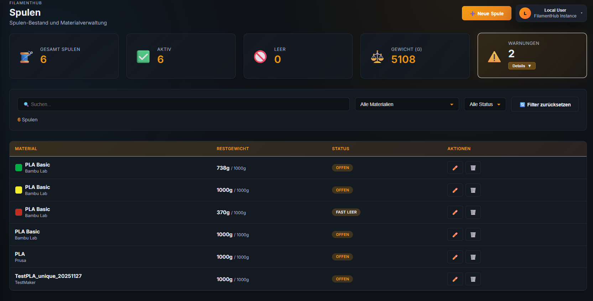
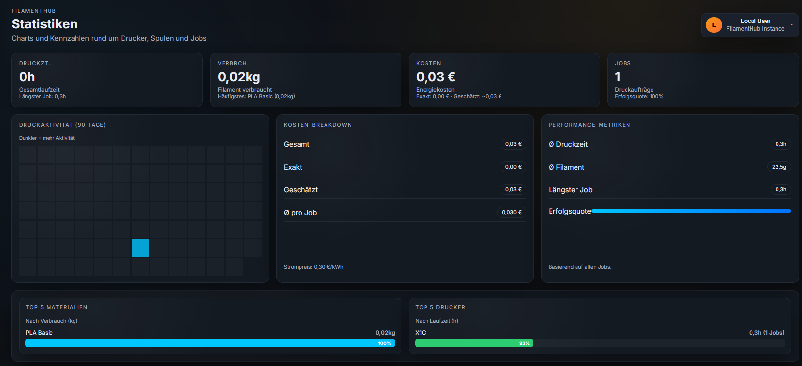
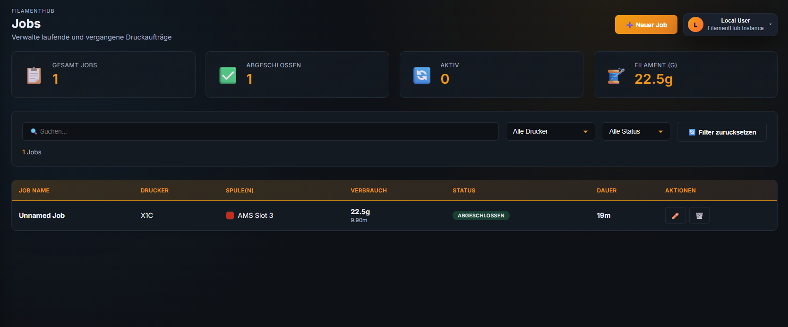

<p align="center">
  
</p>

<h1 align="center">FilamentHub</h1>
<p align="center">Open-Source Dashboard für Filament-, Drucker- und Systemverwaltung – lokal, unabhängig und im modernen Unraid-Stil.</p>

<p align="center">

  <!-- Status -->
  
  

  <!-- Technologie -->
  
  
  

  <!-- Plattform -->
  

  <!-- Lizenz -->
  

  <!-- Build -->
  
  

  <!-- Docker -->
  
  

  <!-- Integration -->
  
  
</p>
<p align="center">
----------------------------------------------------
  </p>
<p align="center">
  <a href="https://www.paypal.me/Denis10" target="_blank">
    
  </a>
</p>

<p align="center">
  <a href="https://ko-fi.com/BOB51PV6CH">
    
  </a>
</p>


> 🇺🇸 **English version:** [README.en.md](README.en.md)

---

# 🧩 Projektübersicht

FilamentHub hat ursprünglich als **kleines, reines Filament-Verwaltungssystem** angefangen.  
Ein einfacher lokaler Manager für Spulen, Farben, Restmengen und Nutzungsdaten.

Mit der Zeit ist das Projekt aber deutlich gewachsen.  
Aus dem ursprünglichen Tool wurde Stück für Stück ein komplettes **3D-Printing-Management-Dashboard**, das heute deutlich mehr abdeckt:

- Filamentverwaltung  
- Druckerüberwachung  
- Systemdiagnose  
- MQTT-Integration  
- Debug-Tools  
- Weboberfläche im Unraid-Stil  
- Docker-Bereitstellung  

Der Name ist geblieben – das Projekt ist weitergewachsen.

---

# 🚀 Funktionen

## **Druckerverwaltung**
- Übersicht über alle registrierten Drucker  
- Live-Status, Temperaturen, aktueller Job  
- LAN-MQTT für Bambu  
- Druckhistorie & Nutzungsdaten  
- Stabiler WebSocket-Status mit Ping/Pong-Analyse (Debug-Ansicht)

## **Filamentverwaltung**
- Spulenverwaltung mit Hersteller, Farbe, Material, Restmenge  
- Letzte Nutzung je Drucker  
- Verbrauch nach Job / Tag / Monat  
- Kostenabschätzungen  
- Warnungen bei niedrigem Bestand  

## **Analyse & Statistiken**
- Druckzeit pro Drucker  
- Filamentverbrauch pro Zeitraum  
- Kostenübersichten  
- Verteilung nach Material, Farbe, Maschine  

## **Weboberfläche (Unraid-inspiriert)**
- Klare Navigation: **Dashboard / Printer / Filament / System / Debug**  
- Karten, Tabellen, Icons, Statusbadges  
- Dunkles, ruhiges UI  
- Responsive Design für Desktop & Server-Umgebungen  

## **Datenbank & Backups**
- Lokale SQLite-Datenbank (automatisch angelegt)  
- Integrierter Backup-Button  
  → erstellt ZIP mit **DB + Logs**  
  → Ablage unter: `data/backups/filamenthub_backup_<timestamp>.zip`  
- Datenbank-Tools: VACUUM, Tabellenviewer, Test-Selekte  

## **Debug & Wartung**
- Debug-Center mit:
  - Systemübersicht  
  - Service-Status  
  - Log-Viewer  
  - MQTT-Monitor mit Sperrzeiten, Ping, Last-Message, Sparkline  
  - Test-Runner (DB-Tests, Smoke-Tests)  
  - Logrotation & Säuberung
# 🖼️ Screenshots

<p align="center">
  <a href="data/screenshots/Dashboard.png">
    
  </a>
  <a href="data/screenshots/Material.png">
    
   </a>
  <a href="data/screenshots/AMS_übersicht.png">
    
  </a>
  <a href="data/screenshots/Spulen.png">
    
  </a>
</p>

<p align="center">
  <sub>
    Dashboard · Material · Spulen
  </sub>
</p>

<p align="center">
  <a href="data/screenshots/statistiken.png">
    
  </a>
  <a href="data/screenshots/statistiken_02.png">
    
  </a>
  <a href="data/screenshots/jobs.png">
    
  </a>
</p>

<p align="center">
  <sub>
    Statistiken · Details · Jobs
  </sub>
</p>

<p align="center">
  <a href="data/screenshots/mini_user_menu.png">
    
  </a>
</p>

<p align="center">
  <sub>
    UI-Details · Benutzer-Menü
  </sub>
</p>


---

# 📅 Status & Roadmap

- Ziel für stabile 1.0: **Mai 2026**  
- Aktueller Entwicklungsstand: funktionsfähig, viele Module im Aufbau  
- Roadmap: [ANLEITUNG/Roadmap.md](ANLEITUNG/Roadmap.md)  
- Handbuch: [ANLEITUNG/Handbuch.md](ANLEITUNG/Handbuch.md)

---

# 🛠️ Quickstart (Development)

```bash
python -m venv .venv
.venv/Scripts/pip install -r requirements.txt  # Windows
# oder
source .venv/bin/activate && pip install -r requirements.txt  # Linux/Mac

python run.py  # Startet API + UI (Port 8080)
