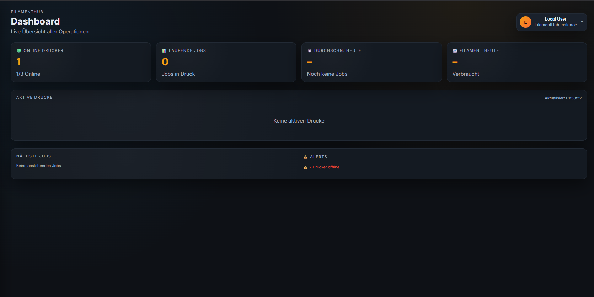
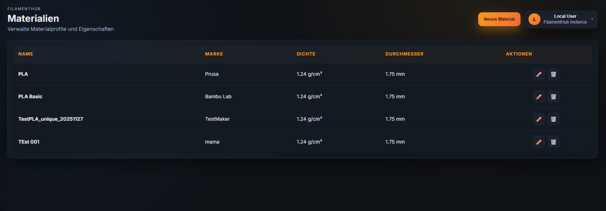
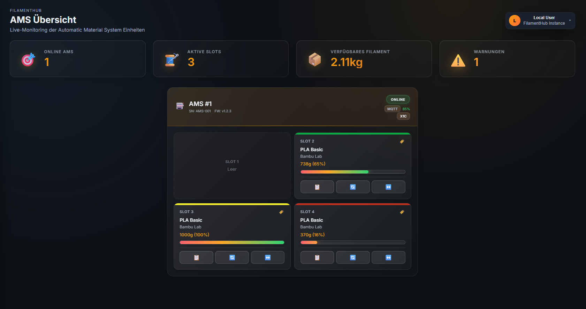
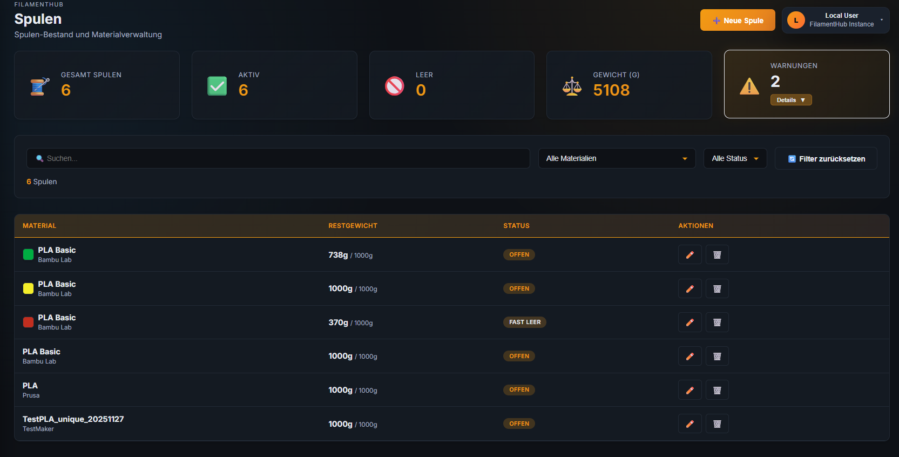
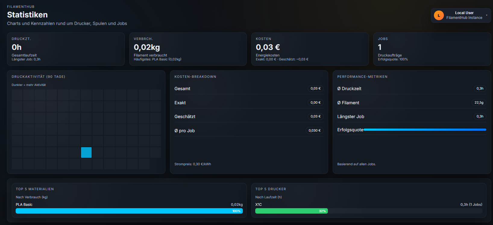
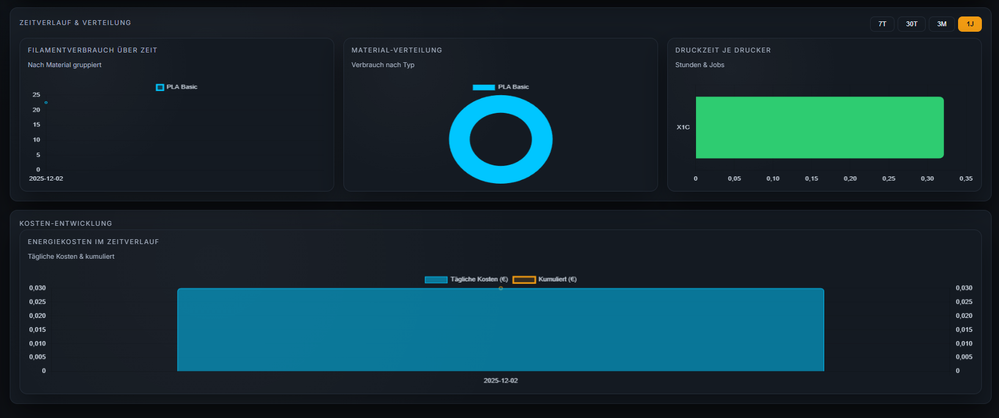
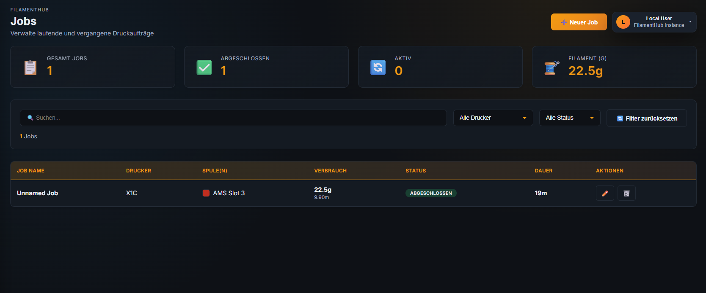
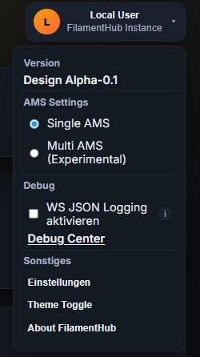

<p align="center">
  
</p>

<h1 align="center">FilamentHub</h1>
<p align="center">
Open-Source Dashboard für Filament-, Drucker- und Systemverwaltung – lokal, unabhängig und im modernen Unraid-Stil.
</p>

<p align="center">

  <!-- Status -->
  
  
  

  <!-- Technologie -->
  
  
  

  <!-- Plattform -->
  

  <!-- Lizenz -->
  

  <!-- Build -->
  
  

  <!-- Docker -->
  
  

  <!-- Integration -->
  
  

</p>

<p align="center">
----------------------------------------------------
</p>

<p align="center">
  <a href="https://www.paypal.me/Denis10" target="_blank">
    
  </a>
</p>

<p align="center">
  <a href="https://ko-fi.com/BOB51PV6CH">
    
  </a>
</p>  

> 🇺🇸 **English version:** [README.en.md](README.en.md)

---


## 🚧 Projektstatus – Public Beta


⚠️ **FilamentHub befindet sich aktuell in einer öffentlichen Beta-Phase (v1.6.0-beta).**

- Die Kernfunktionen sind stabil und aktiv nutzbar
- Datenbank-Migrationen laufen automatisch beim Start
- Job- und Filament-Tracking ist produktiv einsetzbar
- APIs, UI und Datenmodelle können sich noch ändern
- **Regelmäßige Backups der Datenbank werden empfohlen**

Diese Beta richtet sich an technisch versierte Nutzer und Early Adopter.  
Feedback, Bugreports und Verbesserungsvorschläge sind ausdrücklich erwünscht.


👉 **Anleitung: Installation der Beta-Version**  
[Installation-Beta.md](https://github.com/d3nn3s08/FilamentHub/blob/main/ANLEITUNG/Installation-Beta.md)

[](https://github.com/d3nn3s08/FilamentHub/discussions)


⏳ **Hinweis:**  
Ein Build von **15–25 Minuten** ist auf dem Raspberry Pi normal, besonders beim ersten Start.  
Währenddessen wirkt es so, als würde nichts passieren – **das ist kein Fehler**.

Empfehlung:
- Geduld haben
- Konsole offen lassen
- Nicht abbrechen

---

# 🧩 Projektübersicht

FilamentHub hat ursprünglich als **kleines, reines Filament-Verwaltungssystem** angefangen –  
ein lokaler Manager für Spulen, Farben, Restmengen und Nutzungsdaten.

Mit der Zeit ist das Projekt deutlich gewachsen.  
Aus dem ursprünglichen Tool wurde Schritt für Schritt ein vollständiges  
**3D-Printing-Management-Dashboard**, das heute u. a. abdeckt:

- Filamentverwaltung  
- Druckerüberwachung  
- Systemdiagnose  
- MQTT-Integration  
- Debug-Tools  
- Weboberfläche im Unraid-Stil  
- Docker-Bereitstellung  

Der Name ist geblieben – das Projekt ist weitergewachsen.

Heute befindet sich FilamentHub in einer **öffentlichen Beta-Phase** mit Fokus auf  
**Stabilität, Datenintegrität und einer sauberen technischen Basis**.

---

# 🚀 Funktionen

## **Druckerverwaltung**
- Übersicht über alle registrierten Drucker  
- Live-Status, Temperaturen, aktueller Job  
- LAN-MQTT für Bambu  
- Druckhistorie & Nutzungsdaten  
- Stabiler WebSocket-Status mit Ping/Pong-Analyse (Debug-Ansicht)

## **Filamentverwaltung**
- Spulenverwaltung mit Hersteller, Farbe, Material, Restmenge  
- Letzte Nutzung je Drucker  
- Verbrauch nach Job / Tag / Monat  
- Kostenabschätzungen  
- Warnungen bei niedrigem Bestand  

## **Analyse & Statistiken**
- Druckzeit pro Drucker  
- Filamentverbrauch pro Zeitraum  
- Kostenübersichten  
- Verteilung nach Material, Farbe, Maschine  

## **Weboberfläche (Unraid-inspiriert)**
- Klare Navigation: **Dashboard / Printer / Filament / System / Debug**  
- Karten, Tabellen, Icons, Statusbadges  
- Dunkles, ruhiges UI  
- Responsive Design für Desktop- & Server-Umgebungen  

## **Datenbank & Backups**
- Lokale SQLite-Datenbank (automatisch angelegt)  
- Integrierter Backup-Button  
  → erstellt ZIP mit **DB + Logs**  
  → Ablage unter:  
  `data/backups/filamenthub_backup_<timestamp>.zip`  
- Datenbank-Tools: VACUUM, Tabellenviewer, Test-Selekte  

## **Debug & Wartung**
- Debug-Center mit:
  - Systemübersicht  
  - Service-Status  
  - Log-Viewer  
  - MQTT-Monitor mit Sperrzeiten, Ping, Last-Message, Sparkline  
  - Test-Runner (DB-Tests, Smoke-Tests)  
  - Logrotation & Säuberung  

---

# 🖼️ Screenshots

<p align="center">
  <a href="data/screenshots/Dashboard.png">
    
  </a>
  <a href="data/screenshots/Material.png">
    
  </a>
  <a href="data/screenshots/AMS_übersicht.png">
    
  </a>
  <a href="data/screenshots/Spulen.png">
    
  </a>
</p>

<p align="center">
  <sub>Dashboard · Material · Spulen</sub>
</p>

<p align="center">
  <a href="data/screenshots/statistiken.png">
    
  </a>
  <a href="data/screenshots/statistiken_02.png">
    
  </a>
  <a href="data/screenshots/jobs.png">
    
  </a>
</p>

<p align="center">
  <sub>Statistiken · Details · Jobs</sub>
</p>

<p align="center">
  <a href="data/screenshots/mini_user_menu.png">
    
  </a>
</p>

<p align="center">
  <sub>UI-Details · Benutzer-Menü</sub>
</p>

---

# 📅 Status & Roadmap

- Aktueller Entwicklungsstand: **Public Beta – stabil nutzbar, aktiv in Entwicklung**
- Roadmap: [ANLEITUNG/Roadmap.md](ANLEITUNG/Roadmap.md)
- Handbuch: [ANLEITUNG/Handbuch.md](ANLEITUNG/Handbuch.md)

---

# 🛠️ Quickstart (Development)

> ⚠️ Hinweis: Diese Anleitung richtet sich an Entwickler und Beta-Tester.

```bash
python -m venv .venv
.venv/Scripts/pip install -r requirements.txt  # Windows
# oder
source .venv/bin/activate && pip install -r requirements.txt  # Linux/Mac

python run.py  # Startet API + UI (Port 8085)
```

---

# 🚀 Release-Prozess

FilamentHub nutzt [Release Please](https://github.com/googleapis/release-please) für vollautomatisches Versioning, Changelog-Generierung und Docker-Publishing.

## Commit-Konvention (Conventional Commits)

Damit der Release-Agent den Changelog korrekt befüllt und die Version automatisch erhöht, müssen Commits dem [Conventional Commits](https://www.conventionalcommits.org)-Format folgen:

| Typ | Beschreibung | Auswirkung |
|-----|-------------|------------|
| `feat: ...` | Neue Funktion | Minor-Bump (0.x.0) |
| `fix: ...` | Bugfix | Patch-Bump (0.0.x) |
| `feat!: ...` / `BREAKING CHANGE:` | Breaking Change | Major-Bump (x.0.0) |
| `chore: ...` | Wartungsarbeiten | Kein Release |
| `docs: ...` | Dokumentation | Kein Release |
| `refactor: ...` | Code-Umbau | Kein Release |

**Beispiele:**
```
feat: add multi-printer support
fix: correct AMS temperature display
feat!: redesign filament API (breaking change)
```

## Wie ein Release entsteht

1. **Code committen & pushen** auf `main` (mit Conventional Commits)
2. **Release Please öffnet automatisch einen Release-PR** der:
   - Die Version in `config.yaml` erhöht
   - `CHANGELOG.md` aktualisiert
3. **Release-PR mergen** → Release Please erstellt automatisch:
   - Git-Tag (z. B. `v0.2.0`)
   - GitHub Release mit Release Notes aus `CHANGELOG.md`
4. **Docker-Image wird automatisch gebaut** und auf GHCR gepusht:
   - `ghcr.io/d3nn3s08/filamenthub:v0.2.0`
   - `ghcr.io/d3nn3s08/filamenthub:latest`

## Beta-Branch

Pushes auf den `beta`-Branch erzeugen automatisch ein Docker-Image:
- `ghcr.io/d3nn3s08/filamenthub:beta`
- `ghcr.io/d3nn3s08/filamenthub:<version>-beta`

## Docker-Image verwenden

```bash
# Stable
docker pull ghcr.io/d3nn3s08/filamenthub:latest

# Bestimmte Version
docker pull ghcr.io/d3nn3s08/filamenthub:v0.2.0

# Beta
docker pull ghcr.io/d3nn3s08/filamenthub:beta
```

Releases und Artefakte sind unter [GitHub Releases](https://github.com/d3nn3s08/FilamentHub/releases) zu finden.

---

📄 Lizenz: [MIT](LICENSE.md) · 👤 Entwickelt von [d3nn3s08](https://github.com/d3nn3s08)
