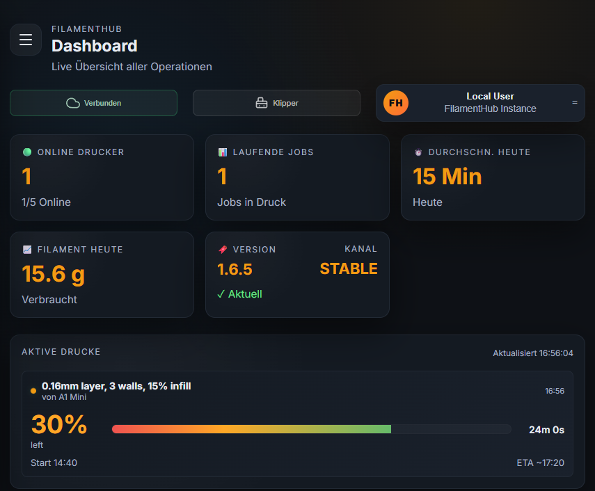
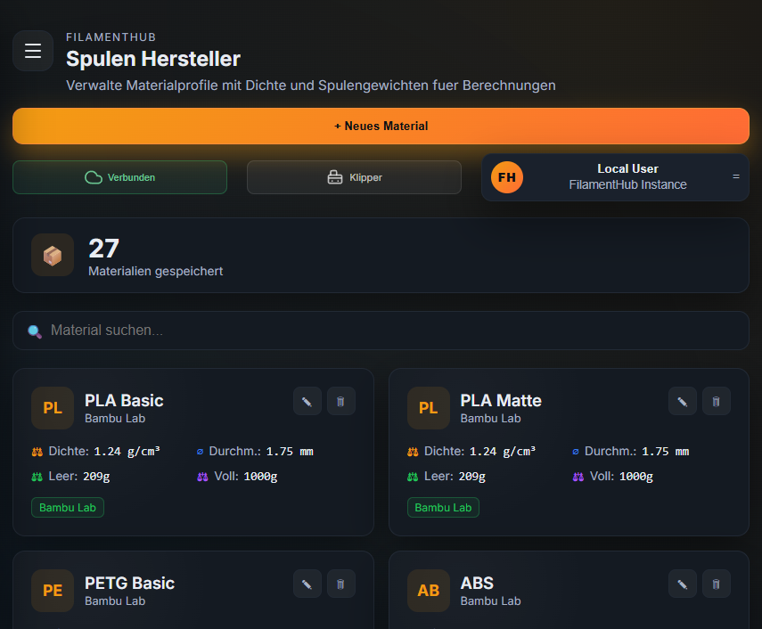
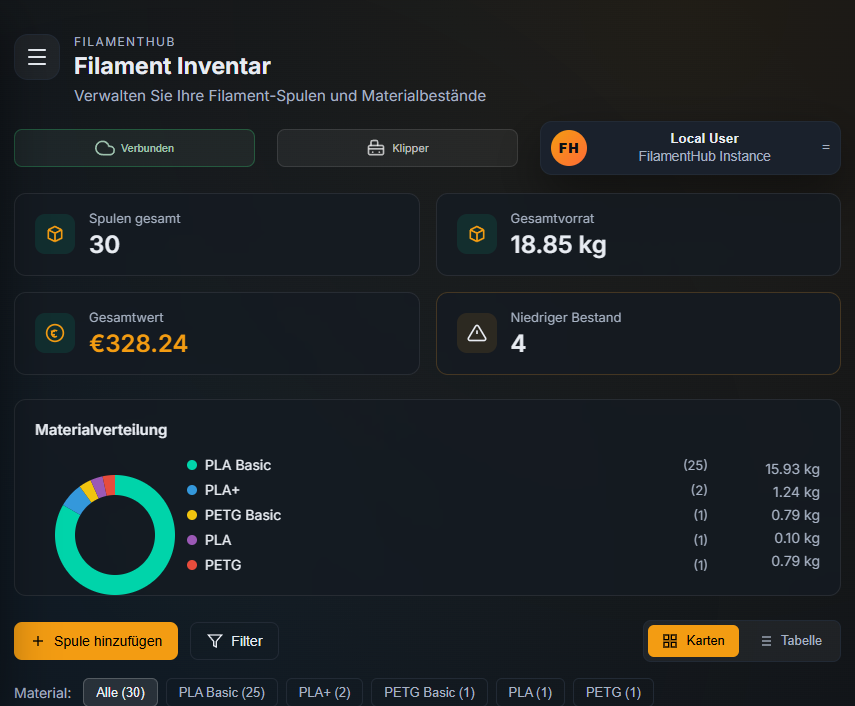
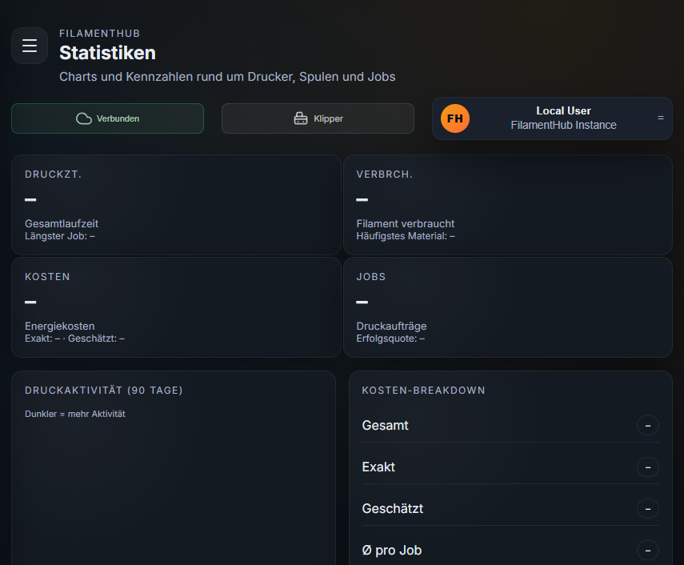
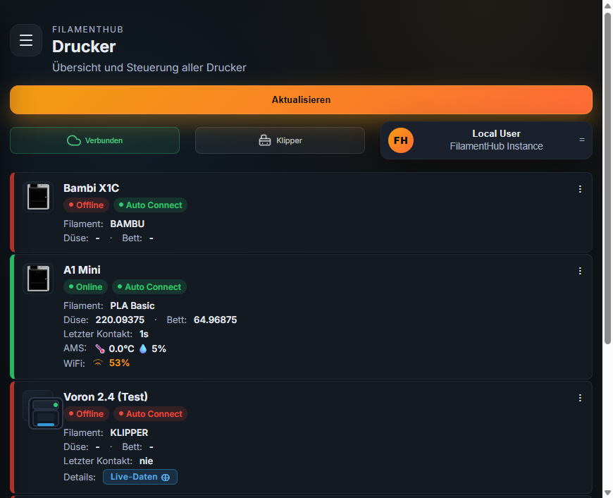
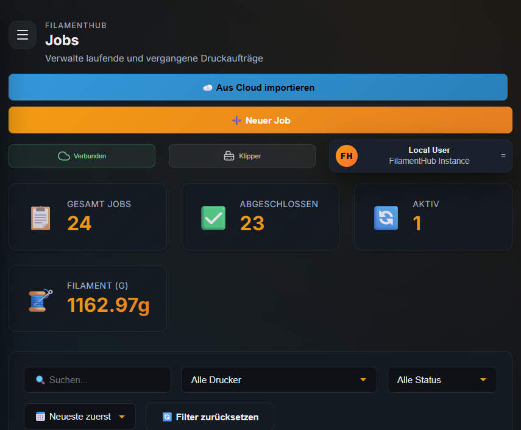
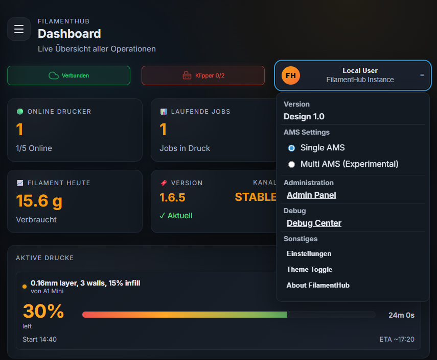

<p align="center">
  
</p>

<h1 align="center">FilamentHub</h1>
<p align="center">
Open-Source Dashboard für Filament-, Drucker- und Systemverwaltung – lokal, unabhängig und im modernen Unraid-Stil.
</p>

<p align="center">
  
  
  
  
  
  
  
  
  
  
  
  
  
  
</p>

<p align="center">----------------------------------------------------</p>

<p align="center">
  <a href="https://www.paypal.me/Denis10" target="_blank">
    
  </a>
</p>

<p align="center">
  <a href="https://ko-fi.com/BOB51PV6CH">
    
  </a>
</p>

> 🇺🇸 **English version:** coming soon

---

## 🚧 Projektstatus – Public Beta


⚠️ **FilamentHub befindet sich aktuell in einer öffentlichen Beta-Phase (v1.6.5).**

- Die Kernfunktionen sind stabil und aktiv nutzbar
- Datenbank-Migrationen laufen automatisch beim Start
- Job- und Filament-Tracking ist produktiv einsetzbar
- APIs, UI und Datenmodelle können sich noch ändern
- **Regelmäßige Backups der Datenbank werden empfohlen**

Diese Beta richtet sich an technisch versierte Nutzer und Early Adopter.  
Feedback, Bugreports und Verbesserungsvorschläge sind ausdrücklich erwünscht.

👉 **Anleitung: Installation der Beta-Version**  
Die öffentliche Installationsanleitung wird aktuell überarbeitet.

[](https://github.com/d3nn3s08/FilamentHub/discussions)

⏳ **Hinweis:**  
Ein Build von **15–25 Minuten** ist auf dem Raspberry Pi normal, besonders beim ersten Start.  
Währenddessen wirkt es so, als würde nichts passieren – **das ist kein Fehler**.

Empfehlung:
- Geduld haben
- Konsole offen lassen
- Nicht abbrechen

---

# 🧩 Projektübersicht

FilamentHub hat ursprünglich als **kleines, reines Filament-Verwaltungssystem** angefangen –  
ein lokaler Manager für Spulen, Farben, Restmengen und Nutzungsdaten.

Mit der Zeit ist das Projekt deutlich gewachsen.  
Aus dem ursprünglichen Tool wurde Schritt für Schritt ein vollständiges  
**3D-Printing-Management-Dashboard**, das heute u. a. abdeckt:

- Filamentverwaltung
- Druckerüberwachung
- Systemdiagnose
- MQTT-Integration
- Debug-Tools
- Weboberfläche im Unraid-Stil
- Docker-Bereitstellung

Der Name ist geblieben – das Projekt ist weitergewachsen.

Heute befindet sich FilamentHub in einer **öffentlichen Beta-Phase** mit Fokus auf  
**Stabilität, Datenintegrität und einer sauberen technischen Basis**.

---

# 🚀 Funktionen

## Druckerverwaltung

- Übersicht über alle registrierten Drucker
- Live-Status, Temperaturen, aktueller Job
- LAN-MQTT für Bambu
- Druckhistorie und Nutzungsdaten
- Stabiler WebSocket-Status mit Ping/Pong-Analyse im Debug-Bereich

## Filamentverwaltung

- Spulenverwaltung mit Hersteller, Farbe, Material und Restmenge
- Letzte Nutzung je Drucker
- Verbrauch nach Job, Tag und Monat
- Kostenabschätzungen
- Warnungen bei niedrigem Bestand

## Analyse & Statistiken

- Druckzeit pro Drucker
- Filamentverbrauch pro Zeitraum
- Kostenübersichten
- Verteilung nach Material, Farbe und Maschine

## Weboberfläche (Unraid-inspiriert)

- Klare Navigation: **Dashboard / Printer / Filament / System / Debug**
- Karten, Tabellen, Icons und Statusbadges
- Dunkles, ruhiges UI
- Responsive Design für Desktop- und Server-Umgebungen

## Datenbank & Backups

- Lokale SQLite-Datenbank, automatisch angelegt
- Integrierter Backup-Button
- ZIP-Export mit **DB + Logs**
- Ablage unter `data/backups/filamenthub_backup_<timestamp>.zip`
- Datenbank-Tools: VACUUM, Tabellenviewer, Test-Selekte

## Debug & Wartung

- Debug-Center mit Systemübersicht
- Service-Status
- Log-Viewer
- MQTT-Monitor mit Sperrzeiten, Ping, Last-Message und Sparkline
- Test-Runner für DB- und Smoke-Tests
- Logrotation und Säuberung

---

# 🖼️ Screenshots

<p align="center">
  <a href="docs/screenshots/dashboard.png">
    
  </a>
  <a href="docs/screenshots/materials.png">
    
  </a>
  <a href="docs/screenshots/spools.png">
    
  </a>
</p>

<p align="center">
  <sub>Dashboard · Material · Spulen</sub>
</p>

<p align="center">
  <a href="docs/screenshots/statistics.png">
    
  </a>
  <a href="docs/screenshots/printers.png">
    
  </a>
  <a href="docs/screenshots/jobs.png">
    
  </a>
</p>

<p align="center">
  <sub>Statistiken · Details · Jobs</sub>
</p>

<p align="center">
  <a href="docs/screenshots/user-menu.png">
    
  </a>
</p>

<p align="center">
  <sub>UI-Details · Benutzer-Menü</sub>
</p>

---

# 📅 Status & Roadmap

- Aktueller Entwicklungsstand: **Public Beta – stabil nutzbar, aktiv in Entwicklung**
- Roadmap: coming soon
- Handbuch: [ANLEITUNG/Handbuch.html](ANLEITUNG/Handbuch.html)

---

# 🛠️ Quickstart (Development)

> ⚠️ Hinweis: Diese Anleitung richtet sich an Entwickler und Beta-Tester.

```bash
python -m venv .venv
.venv/Scripts/pip install -r requirements.txt  # Windows
# oder
source .venv/bin/activate && pip install -r requirements.txt  # Linux/Mac

python run.py  # Startet API + UI (Port 8081)
```
